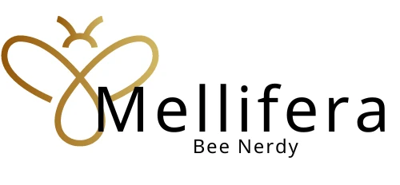

# Mellifera

<div align="center">
  <a href="https://github.com/jstiltner/Mellifera-app">
    
  </a>

<h3 align="center">Mellifera</h3>

  <p align="center">
    A CRUD application built on the MERN stack, enhanced with LLM interfaces and ML capabilities.
    <br />
    <a href="https://github.com/jstiltner/Mellifera-app"><strong>Explore the docs »</strong></a>
    <br />
    <br />
    <a href="https://github.com/jstiltner/Mellifera-app">View Demo</a>
    ·
    <a href="https://github.com/jstiltner/Mellifera-app/issues/new?labels=bug&template=bug-report---.md">Report Bug</a>
    ·
    <a href="https://github.com/jstiltner/Mellifera-app/issues/new?labels=enhancement&template=feature-request---.md">Request Feature</a>
  </p>
</div>

## Table of Contents

- [About The Project](#about-the-project)
  - [Built With](#built-with)
- [Getting Started](#getting-started)
  - [Prerequisites](#prerequisites)
  - [Installation](#installation)
  - [Docker Installation](#docker-installation)
  - [Docker Usage](#docker-usage)
  - [Kubernetes Deployment](#kubernetes-deployment)
- [Usage](#usage)
- [Features](#features)
- [Voice Command UI Demonstration](#voice-command-ui-demonstration)
- [NLU Implementation](#nlu-implementation)
- [Roadmap](#roadmap)
- [Contributing](#contributing)
- [License](#license)
- [Contact](#contact)

## About The Project

Mellifera is designed to be a beekeeper's companion, enabling data-driven decision-making for beekeepers worldwide. It leverages natural language processing to update an extensive, and extensible, database with data about honeybee hives.

### Built With

- [![Nodejs][Nodejs.org]][Nodejs-url]
- [![Expressjs][Expressjs.com]][Expressjs-url]
- [![React][React.js]][React-url]
- [![TanStack Query][TanStack-Query]][TanStack-Query-url]
- [![MongoDB][MongoDB.com]][MongoDB-url]
- [![Tailwindcss][Tailwindcss.com]][Tailwindcss-url]
- [![Whisper][Whisper.com]][Whisper-url]
- [![HuggingFace][HuggingFace.com]][HuggingFace-url]
- [![onnx][onnx.com]][onnx-url]
- [![docker][docker.com]][docker-url]
- [![Swagger][Swagger.io]][Swagger-url]
- [![Kubernetes][Kubernetes.io]][Kubernetes-url]

## Getting Started

To get a local copy up and running, follow these simple steps.

### Prerequisites

- Node.js (latest LTS version)
- npm (comes with Node.js)
- MongoDB
- Docker and Docker Compose (for Docker installation)
- Kubernetes cluster (for Kubernetes deployment)

### Installation

1. Clone the repo
   ```sh
   git clone https://github.com/jstiltner/Mellifera-app.git
   ```
2. Navigate to the project directory
   ```sh
   cd Mellifera-app
   ```
3. Install NPM packages
   ```sh
   npm install
   ```
4. Create a `.env` file in the root directory and add your environment variables (e.g., MongoDB connection string, JWT secret)

5. Start the development server
   ```sh
   npm run dev
   ```

### Docker Installation

If you prefer to use Docker, follow these steps:

1. Ensure you have Docker and Docker Compose installed on your system.

2. Clone the repo (if you haven't already)
   ```sh
   git clone https://github.com/jstiltner/Mellifera-app.git
   ```

3. Navigate to the project directory
   ```sh
   cd Mellifera-app
   ```

4. Create a `secrets` directory in the project root and add the following files with appropriate values:
   - `db_password.txt`: MongoDB database password
   - `mongo_root_username.txt`: MongoDB root username
   - `mongo_root_password.txt`: MongoDB root password

5. Build and run the Docker containers for development:
   ```sh
   docker-compose -f docker-compose.dev.yml up --build
   ```
   Or for production:
   ```sh
   docker-compose -f docker-compose.prod.yml up --build
   ```

6. The application will be available at `http://localhost:5000`

### Recent Docker Changes

We've recently updated the Dockerfile to resolve issues related to bcrypt. The changes include:

- Adding necessary build tools (python3, make, g++) to compile native modules.
- Using a specific Alpine version for consistency.

If you're experiencing any bcrypt-related errors, please follow these steps:

1. Rebuild your Docker images:

   For development:
   ```sh
   docker-compose -f docker-compose.dev.yml build --no-cache
   docker-compose -f docker-compose.dev.yml up
   ```

   For production:
   ```sh
   docker-compose -f docker-compose.prod.yml build --no-cache
   docker-compose -f docker-compose.prod.yml up
   ```

2. If using Kubernetes, update your deployment:

   ```sh
   # Build and push the updated Docker image
   docker build -t your-registry/mellifera-app:v1.0.1 -f Dockerfile.prod .
   docker push your-registry/mellifera-app:v1.0.1
   ```

3. Update the `kubernetes/deployment.yaml` file to use the new image tag:
   ```yaml
   spec:
     containers:
     - name: mellifera-app
       image: your-registry/mellifera-app:v1.0.1
   ```

4. Apply the Kubernetes configurations:
   ```sh
   kubectl apply -f kubernetes/configmap.yaml
   kubectl apply -f kubernetes/deployment.yaml
   kubectl apply -f kubernetes/service.yaml
   ```

5. To check the status of your deployment:
   ```sh
   kubectl get deployments
   kubectl get pods
   kubectl get services
   ```

6. To access the application, use the external IP provided by the LoadBalancer service:
   ```sh
   kubectl get services mellifera-app-service
   ```
   Use the EXTERNAL-IP to access the application in your browser.

7. To update the deployment after making changes:
   ```sh
   kubectl apply -f kubernetes/deployment.yaml
   ```

8. To scale the deployment:
   ```sh
   kubectl scale deployment mellifera-app --replicas=5
   ```

9. To view logs:
   ```sh
   kubectl logs deployment/mellifera-app
   ```

10. To delete the deployment:
    ```sh
    kubectl delete -f kubernetes/
    ```

Remember to update the ConfigMap (`kubernetes/configmap.yaml`) with the appropriate environment variables for your deployment.

Note: After making changes to the Dockerfile or application code, always rebuild the Docker image, push it to your registry, update the image tag in the deployment.yaml file, and then apply the changes to your Kubernetes cluster.

## Usage

Mellifera allows beekeepers to easily record their observations and manage their hives hands-free using voice commands. The app is designed to be used in the field, where traditional input methods are impractical.

## Features

### React Query Implementation

- Optimized data fetching with automatic caching and background updates
- Seamless integration with our REST API
- Improved performance and user experience with instant UI updates

### Voice Control

- Speech recognition for voice commands
- Natural Language Processing (NLP) for understanding complex instructions
- Text-to-speech feedback for a fully hands-free experience

## Voice Command UI Demonstration

Mellifera's Voice Command UI allows users to interact with the application using natural language commands. Here's a step-by-step demonstration of how to use voice commands for common tasks:

1. **Start Listening**:

   - Click the "Start Listening" button or say "Start listening" to activate voice commands.
   - The app will respond with a prompt like "I'm listening" or "Voice commands activated."

2. **Select an Apiary**:

   - Command: "Select apiary [name]"
   - Example: "Select apiary Sunflower Fields"
   - The app will confirm the selection: "Apiary Sunflower Fields selected."

3. **Create a New Hive**:

   - Command: "Add hive" or "Create new hive"
   - The app will navigate to the hive creation form and confirm: "Navigating to create a new hive."

4. **Start an Inspection**:

   - Command: "Start inspection" or "Begin hive check"
   - The app will navigate to the inspection form for the selected apiary and confirm: "Starting a new inspection for Sunflower Fields apiary."

5. **View Apiaries**:

   - Command: "Show apiaries" or "List bee yards"
   - The app will navigate to the apiaries list and confirm: "Displaying the list of apiaries."

6. **Create a New Apiary**:

   - Command: "Create apiary" or "Add new bee yard"
   - The app will navigate to the apiary creation form and confirm: "Navigating to create a new apiary."

7. **Return to Dashboard**:

   - Command: "Go to dashboard" or "Show main screen"
   - The app will navigate to the main dashboard and confirm: "Returning to the main dashboard."

8. **Get Help**:

   - Command: "Show help" or "What can you do?"
   - The app will display or speak a list of available commands.

9. **Stop Listening**:
   - Click the "Stop Listening" button or say "Stop listening" to deactivate voice commands.
   - The app will confirm: "Voice commands paused. Click Start Listening when you need me again."

## NLU Implementation

Mellifera uses Natural Language Understanding (NLU) to process voice commands and convert them into actionable instructions. Here's an overview of how the NLU is implemented:

1. **Speech Recognition**:

   - The app uses the Web Speech API (via the `useSpeechRecognition` hook) to convert spoken words into text.

2. **Command Processing**:

   - The transcribed text is sent to a backend service (accessed through the `useVoiceCommand` hook) that uses advanced NLP techniques to understand the user's intent.

3. **Context-Aware Processing**:

   - The NLU system takes into account the current context (e.g., selected apiary, current page) to improve command interpretation accuracy.

4. **Action Determination**:

   - Based on the understood intent and context, the system determines the appropriate action (e.g., navigate to a page, create a new entity, or provide information).

5. **Feedback Loop**:

   - The app provides audio feedback using text-to-speech, confirming the understood command and the action taken.

6. **Error Handling**:

   - If a command is not understood or cannot be executed, the system provides helpful error messages and suggestions.

7. **Continuous Learning**:
   - The NLU system is designed to improve over time, learning from user interactions to better understand various phrasings and dialects.

This implementation allows for a flexible and user-friendly voice interface, enabling beekeepers to interact with the app naturally, even with hands full or while wearing protective gear.

## Roadmap

- [x] MVP
  - [x] Web UI
  - [x] DB
  - [x] Basic reporting functionality
- [x] "Hive Inspection Companion"
  - [x] LLM Integration
  - [x] NLP for inputs
  - [x] Audio output
- [ ] ML
  - [ ] Build a self-improving model with data collected over time by userbase
- [ ] Mobile app development
- [ ] Offline mode with data synchronization

See the [open issues](https://github.com/jstiltner/Mellifera-app/issues) for a full list of proposed features (and known issues).

## Contributing

Contributions are what make the open source community such an amazing place to learn, inspire, and create. Any contributions you make are **greatly appreciated**.

If you have a suggestion that would make this better, please fork the repo and create a pull request. You can also simply open an issue with the tag "enhancement".
Don't forget to give the project a star! Thanks again!

1. Fork the Project
2. Create your Feature Branch (`git checkout -b feature/AmazingFeature`)
3. Commit your Changes (`git commit -m 'Add some AmazingFeature'`)
4. Push to the Branch (`git push origin feature/AmazingFeature`)
5. Open a Pull Request

## License

This project is proprietary software. All rights reserved. See `LICENSE.txt` for more information.

## Contact

Jason L Stiltner - [@jasonlstiltner](https://x.com/jasonlstiltner) - mr@jasonstiltner.com

Project Link: [https://github.com/jstiltner/Mellifera-app](https://github.com/jstiltner/Mellifera-app)

<!-- MARKDOWN LINKS & IMAGES -->

[React.js]: https://img.shields.io/badge/React-20232A?style=for-the-badge&logo=react&logoColor=61DAFB
[React-url]: https://reactjs.org/
[Bootstrap.com]: https://img.shields.io/badge/Bootstrap-563D7C?style=for-the-badge&logo=bootstrap&logoColor=white
[Tailwindcss.com]: https://img.shields.io/badge/Tailwind%20CSS-06B6D4?logo=tailwindcss&logoColor=fff&style=for-the-badge
[Tailwindcss-url]: https://tailwindcss.com
[Expressjs.com]: https://img.shields.io/badge/express-000000?style=for-the-badge&logo=express&logocolor=white
[Expressjs-url]: https://expressjs.com
[Nodejs.org]: https://img.shields.io/badge/nodejs-FFFFFF?style=for-the-badge&logo=node.js&logoColor=5FA04E
[Nodejs-url]: https://nodejs.org
[MongoDB.com]: https://img.shields.io/badge/mongodb-47A248?style=for-the-badge&logo=MongoDB&logoColor=47A248&labelColor=000000&color=47A248&
[MongoDB-url]: https://mongodb.com
[TanStack-Query]: https://img.shields.io/badge/TanStack%20Query-FF4154?style=for-the-badge&logo=reactquery&logoColor=white
[TanStack-Query-url]: https://tanstack.com/query/latest
[Whisper-url]: https://github.com/openai/whisper
[Whisper.com]: https://img.shields.io/badge/OpenAI-412991?style=for-the-badge&logo=openai&logoColor=fff&style=flat
[HuggingFace-url]: https://huggingface.co/
[HuggingFace.com]: https://img.shields.io/badge/Hugging%20Face-FFD21E?style=for-the-badge&logo=huggingface&logoColor=000&style=flat
[onnx.com]: https://img.shields.io/badge/ONNX-005CED?style=for-the-badge&logo=onnx&logoColor=fff&style=flat
[onnx-url]: https://onnx.ai
[docker-url]: https://www.docker.com
[docker.com]: https://img.shields.io/badge/Docker-2496ED?style=for-the-badge&logo=docker&logoColor=fff&style=flat
[swagger.io]: https://img.shields.io/badge/Swagger-85EA2D?style=for-the-badge&logo=swagger&logoColor=000&style=flat
[swagger-url]: https://swagger.io
[Kubernetes.io]: https://img.shields.io/badge/kubernetes-%23326ce5.svg?style=for-the-badge&logo=kubernetes&logoColor=white
[Kubernetes-url]: https://kubernetes.io/

9. To view logs:
   ```sh
   kubectl logs deployment/mellifera-app
   ```

10. To delete the deployment:
    ```sh
    kubectl delete -f kubernetes/
    ```

Remember to update the ConfigMap (`kubernetes/configmap.yaml`) with the appropriate environment variables for your deployment.

Note: After making changes to the Dockerfile or application code, always rebuild the Docker image, push it to your registry, update the image tag in the deployment.yaml file, and then apply the changes to your Kubernetes cluster.

## Usage

Mellifera allows beekeepers to easily record their observations and manage their hives hands-free using voice commands. The app is designed to be used in the field, where traditional input methods are impractical.

## Features

### React Query Implementation

- Optimized data fetching with automatic caching and background updates
- Seamless integration with our REST API
- Improved performance and user experience with instant UI updates

### Voice Control

- Speech recognition for voice commands
- Natural Language Processing (NLP) for understanding complex instructions
- Text-to-speech feedback for a fully hands-free experience

## Voice Command UI Demonstration

Mellifera's Voice Command UI allows users to interact with the application using natural language commands. Here's a step-by-step demonstration of how to use voice commands for common tasks:

1. **Start Listening**:

   - Click the "Start Listening" button or say "Start listening" to activate voice commands.
   - The app will respond with a prompt like "I'm listening" or "Voice commands activated."

2. **Select an Apiary**:

   - Command: "Select apiary [name]"
   - Example: "Select apiary Sunflower Fields"
   - The app will confirm the selection: "Apiary Sunflower Fields selected."

3. **Create a New Hive**:

   - Command: "Add hive" or "Create new hive"
   - The app will navigate to the hive creation form and confirm: "Navigating to create a new hive."

4. **Start an Inspection**:

   - Command: "Start inspection" or "Begin hive check"
   - The app will navigate to the inspection form for the selected apiary and confirm: "Starting a new inspection for Sunflower Fields apiary."

5. **View Apiaries**:

   - Command: "Show apiaries" or "List bee yards"
   - The app will navigate to the apiaries list and confirm: "Displaying the list of apiaries."

6. **Create a New Apiary**:

   - Command: "Create apiary" or "Add new bee yard"
   - The app will navigate to the apiary creation form and confirm: "Navigating to create a new apiary."

7. **Return to Dashboard**:

   - Command: "Go to dashboard" or "Show main screen"
   - The app will navigate to the main dashboard and confirm: "Returning to the main dashboard."

8. **Get Help**:

   - Command: "Show help" or "What can you do?"
   - The app will display or speak a list of available commands.

9. **Stop Listening**:
   - Click the "Stop Listening" button or say "Stop listening" to deactivate voice commands.
   - The app will confirm: "Voice commands paused. Click Start Listening when you need me again."

## NLU Implementation

Mellifera uses Natural Language Understanding (NLU) to process voice commands and convert them into actionable instructions. Here's an overview of how the NLU is implemented:

1. **Speech Recognition**:

   - The app uses the Web Speech API (via the `useSpeechRecognition` hook) to convert spoken words into text.

2. **Command Processing**:

   - The transcribed text is sent to a backend service (accessed through the `useVoiceCommand` hook) that uses advanced NLP techniques to understand the user's intent.

3. **Context-Aware Processing**:

   - The NLU system takes into account the current context (e.g., selected apiary, current page) to improve command interpretation accuracy.

4. **Action Determination**:

   - Based on the understood intent and context, the system determines the appropriate action (e.g., navigate to a page, create a new entity, or provide information).

5. **Feedback Loop**:

   - The app provides audio feedback using text-to-speech, confirming the understood command and the action taken.

6. **Error Handling**:

   - If a command is not understood or cannot be executed, the system provides helpful error messages and suggestions.

7. **Continuous Learning**:
   - The NLU system is designed to improve over time, learning from user interactions to better understand various phrasings and dialects.

This implementation allows for a flexible and user-friendly voice interface, enabling beekeepers to interact with the app naturally, even with hands full or while wearing protective gear.

## Roadmap

- [x] MVP
  - [x] Web UI
  - [x] DB
  - [x] Basic reporting functionality
- [x] "Hive Inspection Companion"
  - [x] LLM Integration
  - [x] NLP for inputs
  - [x] Audio output
- [ ] ML
  - [ ] Build a self-improving model with data collected over time by userbase
- [ ] Mobile app development
- [ ] Offline mode with data synchronization

See the [open issues](https://github.com/jstiltner/Mellifera-app/issues) for a full list of proposed features (and known issues).

## Contributing

Contributions are what make the open source community such an amazing place to learn, inspire, and create. Any contributions you make are **greatly appreciated**.

If you have a suggestion that would make this better, please fork the repo and create a pull request. You can also simply open an issue with the tag "enhancement".
Don't forget to give the project a star! Thanks again!

1. Fork the Project
2. Create your Feature Branch (`git checkout -b feature/AmazingFeature`)
3. Commit your Changes (`git commit -m 'Add some AmazingFeature'`)
4. Push to the Branch (`git push origin feature/AmazingFeature`)
5. Open a Pull Request

## License

This project is proprietary software. All rights reserved. See `LICENSE.txt` for more information.

## Contact

Jason L Stiltner - [@jasonlstiltner](https://x.com/jasonlstiltner) - mr@jasonstiltner.com

Project Link: [https://github.com/jstiltner/Mellifera-app](https://github.com/jstiltner/Mellifera-app)

<!-- MARKDOWN LINKS & IMAGES -->

[React.js]: https://img.shields.io/badge/React-20232A?style=for-the-badge&logo=react&logoColor=61DAFB
[React-url]: https://reactjs.org/
[Bootstrap.com]: https://img.shields.io/badge/Bootstrap-563D7C?style=for-the-badge&logo=bootstrap&logoColor=white
[Tailwindcss.com]: https://img.shields.io/badge/Tailwind%20CSS-06B6D4?logo=tailwindcss&logoColor=fff&style=for-the-badge
[Tailwindcss-url]: https://tailwindcss.com
[Expressjs.com]: https://img.shields.io/badge/express-000000?style=for-the-badge&logo=express&logocolor=white
[Expressjs-url]: https://expressjs.com
[Nodejs.org]: https://img.shields.io/badge/nodejs-FFFFFF?style=for-the-badge&logo=node.js&logoColor=5FA04E
[Nodejs-url]: https://nodejs.org
[MongoDB.com]: https://img.shields.io/badge/mongodb-47A248?style=for-the-badge&logo=MongoDB&logoColor=47A248&labelColor=000000&color=47A248&
[MongoDB-url]: https://mongodb.com
[TanStack-Query]: https://img.shields.io/badge/TanStack%20Query-FF4154?style=for-the-badge&logo=reactquery&logoColor=white
[TanStack-Query-url]: https://tanstack.com/query/latest
[Whisper-url]: https://github.com/openai/whisper
[Whisper.com]: https://img.shields.io/badge/OpenAI-412991?style=for-the-badge&logo=openai&logoColor=fff&style=flat
[HuggingFace-url]: https://huggingface.co/
[HuggingFace.com]: https://img.shields.io/badge/Hugging%20Face-FFD21E?style=for-the-badge&logo=huggingface&logoColor=000&style=flat
[onnx.com]: https://img.shields.io/badge/ONNX-005CED?style=for-the-badge&logo=onnx&logoColor=fff&style=flat
[onnx-url]: https://onnx.ai
[docker-url]: https://www.docker.com
[docker.com]: https://img.shields.io/badge/Docker-2496ED?style=for-the-badge&logo=docker&logoColor=fff&style=flat
[swagger.io]: https://img.shields.io/badge/Swagger-85EA2D?style=for-the-badge&logo=swagger&logoColor=000&style=flat
[swagger-url]: https://swagger.io
[Kubernetes.io]: https://img.shields.io/badge/kubernetes-%23326ce5.svg?style=for-the-badge&logo=kubernetes&logoColor=white
[Kubernetes-url]: https://kubernetes.io/

9. To view logs:
   ```sh
   kubectl logs deployment/mellifera-app
   ```

10. To delete the deployment:
    ```sh
    kubectl delete -f kubernetes/
    ```

Remember to update the ConfigMap (`kubernetes/configmap.yaml`) with the appropriate environment variables for your deployment.

Note: After making changes to the Dockerfile or application code, always rebuild the Docker image, push it to your registry, update the image tag in the deployment.yaml file, and then apply the changes to your Kubernetes cluster.

## Usage

Mellifera allows beekeepers to easily record their observations and manage their hives hands-free using voice commands. The app is designed to be used in the field, where traditional input methods are impractical.

## Features

### React Query Implementation

- Optimized data fetching with automatic caching and background updates
- Seamless integration with our REST API
- Improved performance and user experience with instant UI updates

### Voice Control

- Speech recognition for voice commands
- Natural Language Processing (NLP) for understanding complex instructions
- Text-to-speech feedback for a fully hands-free experience

## Voice Command UI Demonstration

Mellifera's Voice Command UI allows users to interact with the application using natural language commands. Here's a step-by-step demonstration of how to use voice commands for common tasks:

1. **Start Listening**:

   - Click the "Start Listening" button or say "Start listening" to activate voice commands.
   - The app will respond with a prompt like "I'm listening" or "Voice commands activated."

2. **Select an Apiary**:

   - Command: "Select apiary [name]"
   - Example: "Select apiary Sunflower Fields"
   - The app will confirm the selection: "Apiary Sunflower Fields selected."

3. **Create a New Hive**:

   - Command: "Add hive" or "Create new hive"
   - The app will navigate to the hive creation form and confirm: "Navigating to create a new hive."

4. **Start an Inspection**:

   - Command: "Start inspection" or "Begin hive check"
   - The app will navigate to the inspection form for the selected apiary and confirm: "Starting a new inspection for Sunflower Fields apiary."

5. **View Apiaries**:

   - Command: "Show apiaries" or "List bee yards"
   - The app will navigate to the apiaries list and confirm: "Displaying the list of apiaries."

6. **Create a New Apiary**:

   - Command: "Create apiary" or "Add new bee yard"
   - The app will navigate to the apiary creation form and confirm: "Navigating to create a new apiary."

7. **Return to Dashboard**:

   - Command: "Go to dashboard" or "Show main screen"
   - The app will navigate to the main dashboard and confirm: "Returning to the main dashboard."

8. **Get Help**:

   - Command: "Show help" or "What can you do?"
   - The app will display or speak a list of available commands.

9. **Stop Listening**:
   - Click the "Stop Listening" button or say "Stop listening" to deactivate voice commands.
   - The app will confirm: "Voice commands paused. Click Start Listening when you need me again."

## NLU Implementation

Mellifera uses Natural Language Understanding (NLU) to process voice commands and convert them into actionable instructions. Here's an overview of how the NLU is implemented:

1. **Speech Recognition**:

   - The app uses the Web Speech API (via the `useSpeechRecognition` hook) to convert spoken words into text.

2. **Command Processing**:

   - The transcribed text is sent to a backend service (accessed through the `useVoiceCommand` hook) that uses advanced NLP techniques to understand the user's intent.

3. **Context-Aware Processing**:

   - The NLU system takes into account the current context (e.g., selected apiary, current page) to improve command interpretation accuracy.

4. **Action Determination**:

   - Based on the understood intent and context, the system determines the appropriate action (e.g., navigate to a page, create a new entity, or provide information).

5. **Feedback Loop**:

   - The app provides audio feedback using text-to-speech, confirming the understood command and the action taken.

6. **Error Handling**:

   - If a command is not understood or cannot be executed, the system provides helpful error messages and suggestions.

7. **Continuous Learning**:
   - The NLU system is designed to improve over time, learning from user interactions to better understand various phrasings and dialects.

This implementation allows for a flexible and user-friendly voice interface, enabling beekeepers to interact with the app naturally, even with hands full or while wearing protective gear.

## Roadmap

- [x] MVP
  - [x] Web UI
  - [x] DB
  - [x] Basic reporting functionality
- [x] "Hive Inspection Companion"
  - [x] LLM Integration
  - [x] NLP for inputs
  - [x] Audio output
- [ ] ML
  - [ ] Build a self-improving model with data collected over time by userbase
- [ ] Mobile app development
- [ ] Offline mode with data synchronization

See the [open issues](https://github.com/jstiltner/Mellifera-app/issues) for a full list of proposed features (and known issues).

## Contributing

Contributions are what make the open source community such an amazing place to learn, inspire, and create. Any contributions you make are **greatly appreciated**.

If you have a suggestion that would make this better, please fork the repo and create a pull request. You can also simply open an issue with the tag "enhancement".
Don't forget to give the project a star! Thanks again!

1. Fork the Project
2. Create your Feature Branch (`git checkout -b feature/AmazingFeature`)
3. Commit your Changes (`git commit -m 'Add some AmazingFeature'`)
4. Push to the Branch (`git push origin feature/AmazingFeature`)
5. Open a Pull Request

## License

This project is proprietary software. All rights reserved. See `LICENSE.txt` for more information.

## Contact

Jason L Stiltner - [@jasonlstiltner](https://x.com/jasonlstiltner) - mr@jasonstiltner.com

Project Link: [https://github.com/jstiltner/Mellifera-app](https://github.com/jstiltner/Mellifera-app)

<!-- MARKDOWN LINKS & IMAGES -->

[React.js]: https://img.shields.io/badge/React-20232A?style=for-the-badge&logo=react&logoColor=61DAFB
[React-url]: https://reactjs.org/
[Bootstrap.com]: https://img.shields.io/badge/Bootstrap-563D7C?style=for-the-badge&logo=bootstrap&logoColor=white
[Tailwindcss.com]: https://img.shields.io/badge/Tailwind%20CSS-06B6D4?logo=tailwindcss&logoColor=fff&style=for-the-badge
[Tailwindcss-url]: https://tailwindcss.com
[Expressjs.com]: https://img.shields.io/badge/express-000000?style=for-the-badge&logo=express&logocolor=white
[Expressjs-url]: https://expressjs.com
[Nodejs.org]: https://img.shields.io/badge/nodejs-FFFFFF?style=for-the-badge&logo=node.js&logoColor=5FA04E
[Nodejs-url]: https://nodejs.org
[MongoDB.com]: https://img.shields.io/badge/mongodb-47A248?style=for-the-badge&logo=MongoDB&logoColor=47A248&labelColor=000000&color=47A248&
[MongoDB-url]: https://mongodb.com
[TanStack-Query]: https://img.shields.io/badge/TanStack%20Query-FF4154?style=for-the-badge&logo=reactquery&logoColor=white
[TanStack-Query-url]: https://tanstack.com/query/latest
[Whisper-url]: https://github.com/openai/whisper
[Whisper.com]: https://img.shields.io/badge/OpenAI-412991?style=for-the-badge&logo=openai&logoColor=fff&style=flat
[HuggingFace-url]: https://huggingface.co/
[HuggingFace.com]: https://img.shields.io/badge/Hugging%20Face-FFD21E?style=for-the-badge&logo=huggingface&logoColor=000&style=flat
[onnx.com]: https://img.shields.io/badge/ONNX-005CED?style=for-the-badge&logo=onnx&logoColor=fff&style=flat
[onnx-url]: https://onnx.ai
[docker-url]: https://www.docker.com
[docker.com]: https://img.shields.io/badge/Docker-2496ED?style=for-the-badge&logo=docker&logoColor=fff&style=flat
[swagger.io]: https://img.shields.io/badge/Swagger-85EA2D?style=for-the-badge&logo=swagger&logoColor=000&style=flat
[swagger-url]: https://swagger.io
[Kubernetes.io]: https://img.shields.io/badge/kubernetes-%23326ce5.svg?style=for-the-badge&logo=kubernetes&logoColor=white
[Kubernetes-url]: https://kubernetes.io/

9. To view logs:
   ```sh
   kubectl logs deployment/mellifera-app
   ```

10. To delete the deployment:
    ```sh
    kubectl delete -f kubernetes/
    ```

Remember to update the ConfigMap (`kubernetes/configmap.yaml`) with the appropriate environment variables for your deployment.

Note: After making changes to the Dockerfile or application code, always rebuild the Docker image, push it to your registry, update the image tag in the deployment.yaml file, and then apply the changes to your Kubernetes cluster.

## Usage

Mellifera allows beekeepers to easily record their observations and manage their hives hands-free using voice commands. The app is designed to be used in the field, where traditional input methods are impractical.

## Features

### React Query Implementation

- Optimized data fetching with automatic caching and background updates
- Seamless integration with our REST API
- Improved performance and user experience with instant UI updates

### Voice Control

- Speech recognition for voice commands
- Natural Language Processing (NLP) for understanding complex instructions
- Text-to-speech feedback for a fully hands-free experience

## Voice Command UI Demonstration

Mellifera's Voice Command UI allows users to interact with the application using natural language commands. Here's a step-by-step demonstration of how to use voice commands for common tasks:

1. **Start Listening**:

   - Click the "Start Listening" button or say "Start listening" to activate voice commands.
   - The app will respond with a prompt like "I'm listening" or "Voice commands activated."

2. **Select an Apiary**:

   - Command: "Select apiary [name]"
   - Example: "Select apiary Sunflower Fields"
   - The app will confirm the selection: "Apiary Sunflower Fields selected."

3. **Create a New Hive**:

   - Command: "Add hive" or "Create new hive"
   - The app will navigate to the hive creation form and confirm: "Navigating to create a new hive."

4. **Start an Inspection**:

   - Command: "Start inspection" or "Begin hive check"
   - The app will navigate to the inspection form for the selected apiary and confirm: "Starting a new inspection for Sunflower Fields apiary."

5. **View Apiaries**:

   - Command: "Show apiaries" or "List bee yards"
   - The app will navigate to the apiaries list and confirm: "Displaying the list of apiaries."

6. **Create a New Apiary**:

   - Command: "Create apiary" or "Add new bee yard"
   - The app will navigate to the apiary creation form and confirm: "Navigating to create a new apiary."

7. **Return to Dashboard**:

   - Command: "Go to dashboard" or "Show main screen"
   - The app will navigate to the main dashboard and confirm: "Returning to the main dashboard."

8. **Get Help**:

   - Command: "Show help" or "What can you do?"
   - The app will display or speak a list of available commands.

9. **Stop Listening**:
   - Click the "Stop Listening" button or say "Stop listening" to deactivate voice commands.
   - The app will confirm: "Voice commands paused. Click Start Listening when you need me again."

## NLU Implementation

Mellifera uses Natural Language Understanding (NLU) to process voice commands and convert them into actionable instructions. Here's an overview of how the NLU is implemented:

1. **Speech Recognition**:

   - The app uses the Web Speech API (via the `useSpeechRecognition` hook) to convert spoken words into text.

2. **Command Processing**:

   - The transcribed text is sent to a backend service (accessed through the `useVoiceCommand` hook) that uses advanced NLP techniques to understand the user's intent.

3. **Context-Aware Processing**:

   - The NLU system takes into account the current context (e.g., selected apiary, current page) to improve command interpretation accuracy.

4. **Action Determination**:

   - Based on the understood intent and context, the system determines the appropriate action (e.g., navigate to a page, create a new entity, or provide information).

5. **Feedback Loop**:

   - The app provides audio feedback using text-to-speech, confirming the understood command and the action taken.

6. **Error Handling**:

   - If a command is not understood or cannot be executed, the system provides helpful error messages and suggestions.

7. **Continuous Learning**:
   - The NLU system is designed to improve over time, learning from user interactions to better understand various phrasings and dialects.

This implementation allows for a flexible and user-friendly voice interface, enabling beekeepers to interact with the app naturally, even with hands full or while wearing protective gear.

## Roadmap

- [x] MVP
  - [x] Web UI
  - [x] DB
  - [x] Basic reporting functionality
- [x] "Hive Inspection Companion"
  - [x] LLM Integration
  - [x] NLP for inputs
  - [x] Audio output
- [ ] ML
  - [ ] Build a self-improving model with data collected over time by userbase
- [ ] Mobile app development
- [ ] Offline mode with data synchronization

See the [open issues](https://github.com/jstiltner/Mellifera-app/issues) for a full list of proposed features (and known issues).

## Contributing

Contributions are what make the open source community such an amazing place to learn, inspire, and create. Any contributions you make are **greatly appreciated**.

If you have a suggestion that would make this better, please fork the repo and create a pull request. You can also simply open an issue with the tag "enhancement".
Don't forget to give the project a star! Thanks again!

1. Fork the Project
2. Create your Feature Branch (`git checkout -b feature/AmazingFeature`)
3. Commit your Changes (`git commit -m 'Add some AmazingFeature'`)
4. Push to the Branch (`git push origin feature/AmazingFeature`)
5. Open a Pull Request

## License

This project is proprietary software. All rights reserved. See `LICENSE.txt` for more information.

## Contact

Jason L Stiltner - [@jasonlstiltner](https://x.com/jasonlstiltner) - mr@jasonstiltner.com

Project Link: [https://github.com/jstiltner/Mellifera-app](https://github.com/jstiltner/Mellifera-app)

<!-- MARKDOWN LINKS & IMAGES -->

[React.js]: https://img.shields.io/badge/React-20232A?style=for-the-badge&logo=react&logoColor=61DAFB
[React-url]: https://reactjs.org/
[Bootstrap.com]: https://img.shields.io/badge/Bootstrap-563D7C?style=for-the-badge&logo=bootstrap&logoColor=white
[Tailwindcss.com]: https://img.shields.io/badge/Tailwind%20CSS-06B6D4?logo=tailwindcss&logoColor=fff&style=for-the-badge
[Tailwindcss-url]: https://tailwindcss.com
[Expressjs.com]: https://img.shields.io/badge/express-000000?style=for-the-badge&logo=express&logocolor=white
[Expressjs-url]: https://expressjs.com
[Nodejs.org]: https://img.shields.io/badge/nodejs-FFFFFF?style=for-the-badge&logo=node.js&logoColor=5FA04E
[Nodejs-url]: https://nodejs.org
[MongoDB.com]: https://img.shields.io/badge/mongodb-47A248?style=for-the-badge&logo=MongoDB&logoColor=47A248&labelColor=000000&color=47A248&
[MongoDB-url]: https://mongodb.com
[TanStack-Query]: https://img.shields.io/badge/TanStack%20Query-FF4154?style=for-the-badge&logo=reactquery&logoColor=white
[TanStack-Query-url]: https://tanstack.com/query/latest
[Whisper-url]: https://github.com/openai/whisper
[Whisper.com]: https://img.shields.io/badge/OpenAI-412991?style=for-the-badge&logo=openai&logoColor=fff&style=flat
[HuggingFace-url]: https://huggingface.co/
[HuggingFace.com]: https://img.shields.io/badge/Hugging%20Face-FFD21E?style=for-the-badge&logo=huggingface&logoColor=000&style=flat
[onnx.com]: https://img.shields.io/badge/ONNX-005CED?style=for-the-badge&logo=onnx&logoColor=fff&style=flat
[onnx-url]: https://onnx.ai
[docker-url]: https://www.docker.com
[docker.com]: https://img.shields.io/badge/Docker-2496ED?style=for-the-badge&logo=docker&logoColor=fff&style=flat
[swagger.io]: https://img.shields.io/badge/Swagger-85EA2D?style=for-the-badge&logo=swagger&logoColor=000&style=flat
[swagger-url]: https://swagger.io
[Kubernetes.io]: https://img.shields.io/badge/kubernetes-%23326ce5.svg?style=for-the-badge&logo=kubernetes&logoColor=white
[Kubernetes-url]: https://kubernetes.io/

9. To view logs:
   ```sh
   kubectl logs deployment/mellifera-app
   ```

10. To delete the deployment:
    ```sh
    kubectl delete -f kubernetes/
    ```

Remember to update the ConfigMap (`kubernetes/configmap.yaml`) with the appropriate environment variables for your deployment.

Note: After making changes to the Dockerfile or application code, always rebuild the Docker image, push it to your registry, update the image tag in the deployment.yaml file, and then apply the changes to your Kubernetes cluster.

## Usage

Mellifera allows beekeepers to easily record their observations and manage their hives hands-free using voice commands. The app is designed to be used in the field, where traditional input methods are impractical.

## Features

### React Query Implementation

- Optimized data fetching with automatic caching and background updates
- Seamless integration with our REST API
- Improved performance and user experience with instant UI updates

### Voice Control

- Speech recognition for voice commands
- Natural Language Processing (NLP) for understanding complex instructions
- Text-to-speech feedback for a fully hands-free experience

## Voice Command UI Demonstration

Mellifera's Voice Command UI allows users to interact with the application using natural language commands. Here's a step-by-step demonstration of how to use voice commands for common tasks:

1. **Start Listening**:

   - Click the "Start Listening" button or say "Start listening" to activate voice commands.
   - The app will respond with a prompt like "I'm listening" or "Voice commands activated."

2. **Select an Apiary**:

   - Command: "Select apiary [name]"
   - Example: "Select apiary Sunflower Fields"
   - The app will confirm the selection: "Apiary Sunflower Fields selected."

3. **Create a New Hive**:

   - Command: "Add hive" or "Create new hive"
   - The app will navigate to the hive creation form and confirm: "Navigating to create a new hive."

4. **Start an Inspection**:

   - Command: "Start inspection" or "Begin hive check"
   - The app will navigate to the inspection form for the selected apiary and confirm: "Starting a new inspection for Sunflower Fields apiary."

5. **View Apiaries**:

   - Command: "Show apiaries" or "List bee yards"
   - The app will navigate to the apiaries list and confirm: "Displaying the list of apiaries."

6. **Create a New Apiary**:

   - Command: "Create apiary" or "Add new bee yard"
   - The app will navigate to the apiary creation form and confirm: "Navigating to create a new apiary."

7. **Return to Dashboard**:

   - Command: "Go to dashboard" or "Show main screen"
   - The app will navigate to the main dashboard and confirm: "Returning to the main dashboard."

8. **Get Help**:

   - Command: "Show help" or "What can you do?"
   - The app will display or speak a list of available commands.

9. **Stop Listening**:
   - Click the "Stop Listening" button or say "Stop listening" to deactivate voice commands.
   - The app will confirm: "Voice commands paused. Click Start Listening when you need me again."

## NLU Implementation

Mellifera uses Natural Language Understanding (NLU) to process voice commands and convert them into actionable instructions. Here's an overview of how the NLU is implemented:

1. **Speech Recognition**:

   - The app uses the Web Speech API (via the `useSpeechRecognition` hook) to convert spoken words into text.

2. **Command Processing**:

   - The transcribed text is sent to a backend service (accessed through the `useVoiceCommand` hook) that uses advanced NLP techniques to understand the user's intent.

3. **Context-Aware Processing**:

   - The NLU system takes into account the current context (e.g., selected apiary, current page) to improve command interpretation accuracy.

4. **Action Determination**:

   - Based on the understood intent and context, the system determines the appropriate action (e.g., navigate to a page, create a new entity, or provide information).

5. **Feedback Loop**:

   - The app provides audio feedback using text-to-speech, confirming the understood command and the action taken.

6. **Error Handling**:

   - If a command is not understood or cannot be executed, the system provides helpful error messages and suggestions.

7. **Continuous Learning**:
   - The NLU system is designed to improve over time, learning from user interactions to better understand various phrasings and dialects.

This implementation allows for a flexible and user-friendly voice interface, enabling beekeepers to interact with the app naturally, even with hands full or while wearing protective gear.

## Roadmap

- [x] MVP
  - [x] Web UI
  - [x] DB
  - [x] Basic reporting functionality
- [x] "Hive Inspection Companion"
  - [x] LLM Integration
  - [x] NLP for inputs
  - [x] Audio output
- [ ] ML
  - [ ] Build a self-improving model with data collected over time by userbase
- [ ] Mobile app development
- [ ] Offline mode with data synchronization

See the [open issues](https://github.com/jstiltner/Mellifera-app/issues) for a full list of proposed features (and known issues).

## Contributing

Contributions are what make the open source community such an amazing place to learn, inspire, and create. Any contributions you make are **greatly appreciated**.

If you have a suggestion that would make this better, please fork the repo and create a pull request. You can also simply open an issue with the tag "enhancement".
Don't forget to give the project a star! Thanks again!

1. Fork the Project
2. Create your Feature Branch (`git checkout -b feature/AmazingFeature`)
3. Commit your Changes (`git commit -m 'Add some AmazingFeature'`)
4. Push to the Branch (`git push origin feature/AmazingFeature`)
5. Open a Pull Request

## License

This project is proprietary software. All rights reserved. See `LICENSE.txt` for more information.

## Contact

Jason L Stiltner - [@jasonlstiltner](https://x.com/jasonlstiltner) - mr@jasonstiltner.com

Project Link: [https://github.com/jstiltner/Mellifera-app](https://github.com/jstiltner/Mellifera-app)

<!-- MARKDOWN LINKS & IMAGES -->

[React.js]: https://img.shields.io/badge/React-20232A?style=for-the-badge&logo=react&logoColor=61DAFB
[React-url]: https://reactjs.org/
[Bootstrap.com]: https://img.shields.io/badge/Bootstrap-563D7C?style=for-the-badge&logo=bootstrap&logoColor=white
[Tailwindcss.com]: https://img.shields.io/badge/Tailwind%20CSS-06B6D4?logo=tailwindcss&logoColor=fff&style=for-the-badge
[Tailwindcss-url]: https://tailwindcss.com
[Expressjs.com]: https://img.shields.io/badge/express-000000?style=for-the-badge&logo=express&logocolor=white
[Expressjs-url]: https://expressjs.com
[Nodejs.org]: https://img.shields.io/badge/nodejs-FFFFFF?style=for-the-badge&logo=node.js&logoColor=5FA04E
[Nodejs-url]: https://nodejs.org
[MongoDB.com]: https://img.shields.io/badge/mongodb-47A248?style=for-the-badge&logo=MongoDB&logoColor=47A248&labelColor=000000&color=47A248&
[MongoDB-url]: https://mongodb.com
[TanStack-Query]: https://img.shields.io/badge/TanStack%20Query-FF4154?style=for-the-badge&logo=reactquery&logoColor=white
[TanStack-Query-url]: https://tanstack.com/query/latest
[Whisper-url]: https://github.com/openai/whisper
[Whisper.com]: https://img.shields.io/badge/OpenAI-412991?style=for-the-badge&logo=openai&logoColor=fff&style=flat
[HuggingFace-url]: https://huggingface.co/
[HuggingFace.com]: https://img.shields.io/badge/Hugging%20Face-FFD21E?style=for-the-badge&logo=huggingface&logoColor=000&style=flat
[onnx.com]: https://img.shields.io/badge/ONNX-005CED?style=for-the-badge&logo=onnx&logoColor=fff&style=flat
[onnx-url]: https://onnx.ai
[docker-url]: https://www.docker.com
[docker.com]: https://img.shields.io/badge/Docker-2496ED?style=for-the-badge&logo=docker&logoColor=fff&style=flat
[swagger.io]: https://img.shields.io/badge/Swagger-85EA2D?style=for-the-badge&logo=swagger&logoColor=000&style=flat
[swagger-url]: https://swagger.io
[Kubernetes.io]: https://img.shields.io/badge/kubernetes-%23326ce5.svg?style=for-the-badge&logo=kubernetes&logoColor=white
[Kubernetes-url]: https://kubernetes.io/

9. To view logs:
   ```sh
   kubectl logs deployment/mellifera-app
   ```

10. To delete the deployment:
    ```sh
    kubectl delete -f kubernetes/
    ```

Remember to update the ConfigMap (`kubernetes/configmap.yaml`) with the appropriate environment variables for your deployment.

Note: After making changes to the Dockerfile or application code, always rebuild the Docker image, push it to your registry, update the image tag in the deployment.yaml file, and then apply the changes to your Kubernetes cluster.

## Usage

Mellifera allows beekeepers to easily record their observations and manage their hives hands-free using voice commands. The app is designed to be used in the field, where traditional input methods are impractical.

## Features

### React Query Implementation

- Optimized data fetching with automatic caching and background updates
- Seamless integration with our REST API
- Improved performance and user experience with instant UI updates

### Voice Control

- Speech recognition for voice commands
- Natural Language Processing (NLP) for understanding complex instructions
- Text-to-speech feedback for a fully hands-free experience

## Voice Command UI Demonstration

Mellifera's Voice Command UI allows users to interact with the application using natural language commands. Here's a step-by-step demonstration of how to use voice commands for common tasks:

1. **Start Listening**:

   - Click the "Start Listening" button or say "Start listening" to activate voice commands.
   - The app will respond with a prompt like "I'm listening" or "Voice commands activated."

2. **Select an Apiary**:

   - Command: "Select apiary [name]"
   - Example: "Select apiary Sunflower Fields"
   - The app will confirm the selection: "Apiary Sunflower Fields selected."

3. **Create a New Hive**:

   - Command: "Add hive" or "Create new hive"
   - The app will navigate to the hive creation form and confirm: "Navigating to create a new hive."

4. **Start an Inspection**:

   - Command: "Start inspection" or "Begin hive check"
   - The app will navigate to the inspection form for the selected apiary and confirm: "Starting a new inspection for Sunflower Fields apiary."

5. **View Apiaries**:

   - Command: "Show apiaries" or "List bee yards"
   - The app will navigate to the apiaries list and confirm: "Displaying the list of apiaries."

6. **Create a New Apiary**:

   - Command: "Create apiary" or "Add new bee yard"
   - The app will navigate to the apiary creation form and confirm: "Navigating to create a new apiary."

7. **Return to Dashboard**:

   - Command: "Go to dashboard" or "Show main screen"
   - The app will navigate to the main dashboard and confirm: "Returning to the main dashboard."

8. **Get Help**:

   - Command: "Show help" or "What can you do?"
   - The app will display or speak a list of available commands.

9. **Stop Listening**:
   - Click the "Stop Listening" button or say "Stop listening" to deactivate voice commands.
   - The app will confirm: "Voice commands paused. Click Start Listening when you need me again."

## NLU Implementation

Mellifera uses Natural Language Understanding (NLU) to process voice commands and convert them into actionable instructions. Here's an overview of how the NLU is implemented:

1. **Speech Recognition**:

   - The app uses the Web Speech API (via the `useSpeechRecognition` hook) to convert spoken words into text.

2. **Command Processing**:

   - The transcribed text is sent to a backend service (accessed through the `useVoiceCommand` hook) that uses advanced NLP techniques to understand the user's intent.

3. **Context-Aware Processing**:

   - The NLU system takes into account the current context (e.g., selected apiary, current page) to improve command interpretation accuracy.

4. **Action Determination**:

   - Based on the understood intent and context, the system determines the appropriate action (e.g., navigate to a page, create a new entity, or provide information).

5. **Feedback Loop**:

   - The app provides audio feedback using text-to-speech, confirming the understood command and the action taken.

6. **Error Handling**:

   - If a command is not understood or cannot be executed, the system provides helpful error messages and suggestions.

7. **Continuous Learning**:
   - The NLU system is designed to improve over time, learning from user interactions to better understand various phrasings and dialects.

This implementation allows for a flexible and user-friendly voice interface, enabling beekeepers to interact with the app naturally, even with hands full or while wearing protective gear.

## Roadmap

- [x] MVP
  - [x] Web UI
  - [x] DB
  - [x] Basic reporting functionality
- [x] "Hive Inspection Companion"
  - [x] LLM Integration
  - [x] NLP for inputs
  - [x] Audio output
- [ ] ML
  - [ ] Build a self-improving model with data collected over time by userbase
- [ ] Mobile app development
- [ ] Offline mode with data synchronization

See the [open issues](https://github.com/jstiltner/Mellifera-app/issues) for a full list of proposed features (and known issues).

## Contributing

Contributions are what make the open source community such an amazing place to learn, inspire, and create. Any contributions you make are **greatly appreciated**.

If you have a suggestion that would make this better, please fork the repo and create a pull request. You can also simply open an issue with the tag "enhancement".
Don't forget to give the project a star! Thanks again!

1. Fork the Project
2. Create your Feature Branch (`git checkout -b feature/AmazingFeature`)
3. Commit your Changes (`git commit -m 'Add some AmazingFeature'`)
4. Push to the Branch (`git push origin feature/AmazingFeature`)
5. Open a Pull Request

## License

This project is proprietary software. All rights reserved. See `LICENSE.txt` for more information.

## Contact

Jason L Stiltner - [@jasonlstiltner](https://x.com/jasonlstiltner) - mr@jasonstiltner.com

Project Link: [https://github.com/jstiltner/Mellifera-app](https://github.com/jstiltner/Mellifera-app)

<!-- MARKDOWN LINKS & IMAGES -->

[React.js]: https://img.shields.io/badge/React-20232A?style=for-the-badge&logo=react&logoColor=61DAFB
[React-url]: https://reactjs.org/
[Bootstrap.com]: https://img.shields.io/badge/Bootstrap-563D7C?style=for-the-badge&logo=bootstrap&logoColor=white
[Tailwindcss.com]: https://img.shields.io/badge/Tailwind%20CSS-06B6D4?logo=tailwindcss&logoColor=fff&style=for-the-badge
[Tailwindcss-url]: https://tailwindcss.com
[Expressjs.com]: https://img.shields.io/badge/express-000000?style=for-the-badge&logo=express&logocolor=white
[Expressjs-url]: https://expressjs.com
[Nodejs.org]: https://img.shields.io/badge/nodejs-FFFFFF?style=for-the-badge&logo=node.js&logoColor=5FA04E
[Nodejs-url]: https://nodejs.org
[MongoDB.com]: https://img.shields.io/badge/mongodb-47A248?style=for-the-badge&logo=MongoDB&logoColor=47A248&labelColor=000000&color=47A248&
[MongoDB-url]: https://mongodb.com
[TanStack-Query]: https://img.shields.io/badge/TanStack%20Query-FF4154?style=for-the-badge&logo=reactquery&logoColor=white
[TanStack-Query-url]: https://tanstack.com/query/latest
[Whisper-url]: https://github.com/openai/whisper
[Whisper.com]: https://img.shields.io/badge/OpenAI-412991?style=for-the-badge&logo=openai&logoColor=fff&style=flat
[HuggingFace-url]: https://huggingface.co/
[HuggingFace.com]: https://img.shields.io/badge/Hugging%20Face-FFD21E?style=for-the-badge&logo=huggingface&logoColor=000&style=flat
[onnx.com]: https://img.shields.io/badge/ONNX-005CED?style=for-the-badge&logo=onnx&logoColor=fff&style=flat
[onnx-url]: https://onnx.ai
[docker-url]: https://www.docker.com
[docker.com]: https://img.shields.io/badge/Docker-2496ED?style=for-the-badge&logo=docker&logoColor=fff&style=flat
[swagger.io]: https://img.shields.io/badge/Swagger-85EA2D?style=for-the-badge&logo=swagger&logoColor=000&style=flat
[swagger-url]: https://swagger.io
[Kubernetes.io]: https://img.shields.io/badge/kubernetes-%23326ce5.svg?style=for-the-badge&logo=kubernetes&logoColor=white
[Kubernetes-url]: https://kubernetes.io/

